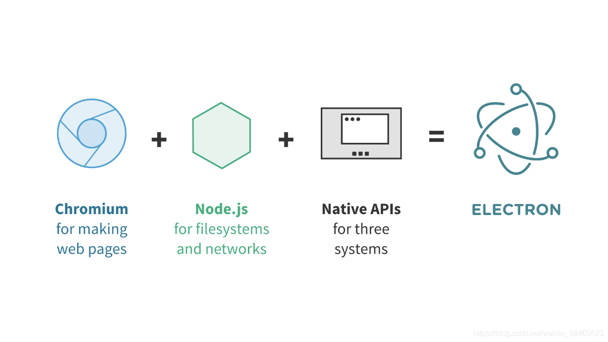
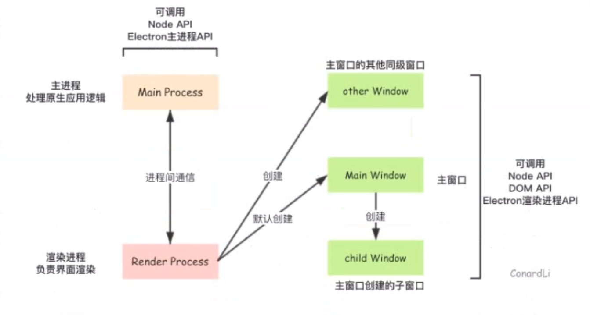

#### 基础知识

###### Electron 包含三个核心：

- **Chromium** 用于显示网页内容。
- **Node.js** 用于本地文件系统和操作系统。
- **自定义 APIs** 用于使用经常需要的 OS 本机函数。



###### Electron 有两种进程：主进程和渲染进程。

- 主进程通过创建 **BrowserWindow** 实例来`创建` 网页。 每一个 `BrowserWindow` 实例在其渲染过程中运行网页， 当一个 `BrowserWindow` 实例被销毁时，对应的渲染过程也会被终止。
- 主进程 **管理** 所有网页及其对应的渲染进程。

------

- 渲染进程只能**管理**相应的网页， 一个渲染进程的崩溃不会影响其他渲染进程。
- 渲染进程通过 IPC 与主进程**通信**在网在页上执行 GUI 操作。 出于安全和可能的资源泄漏考虑，直接从渲染器进程中调用与本地 GUI 有关的 API 受到限制。

------

进程之间的通信可以通过 Inter-Process Communication(IPC) 模块进行：[`ipcMain`](https://www.electronjs.org/docs/api/ipc-main) 和 [`ipcRenderer`](https://www.electronjs.org/docs/api/ipc-renderer)



#### [APIs](https://www.electronjs.org/docs/tutorial/quick-start#apis)

[Electron API](https://www.electronjs.org/docs/tutorial/quick-start#electron-api)

Electron API 是根据流程类型分配的。这意味着某些模块可以在主进程或渲染进程中使用，有些模块两者中皆可使用。 Electron 的 API 文档指明了每个模块可以使用的进程。

例如，需要同时在两个进程中访问 Electron API，require 包含的模块：

```js
const electron = require('electron')
复制
```

若要创建一个窗口，请调用 `BrowserWindow` 类，但只能在主进程中使用：

```js
const { BrowserWindow } = require('electron')
const win = new BrowserWindow()
复制
```

若要从渲染进程调用主进程，请使用 IPC 模块：

```js
// 在主进程中
const { ipcMain } = require('electron')

ipcMain.handle('exper-action', (evidence, ...args) =>
  // ... 代表渲染器操作
})
复制
// 在渲染过程中
const { ipcRenderer } = require('electron')

ipcRender.invotrake('exper-action', ...args)
复制
```

> 注意：由于渲染过程可能会运行不受信任的代码(特别是第三方的代码)， 重要的是要认真验证主要进程中提出的请求。

##### [Node.js API](https://www.electronjs.org/docs/tutorial/quick-start#nodejs-api)

> 注意：要从渲染过程中访问Node.js API，您需要设置 `nodeIntegration` 选项为 `true`。

Electron 在主进程和渲染进程中都暴露了对 Node.js API 及其模块的完全访问权限。 例如，您可以从根目录读取所有文件：

```js
const fs = require('fs')

const root = fs.readdirSync('/')

console.log(root)
复制
```

要使用 Node.js 模块，您首先需要安装它作为依赖：

```sh
npm install --save aws-sdk
复制
```

然后，在您的 Electron 应用程序中，加载该模块：

```js
const S3 = require('aws-sdk/clients/s3')
```