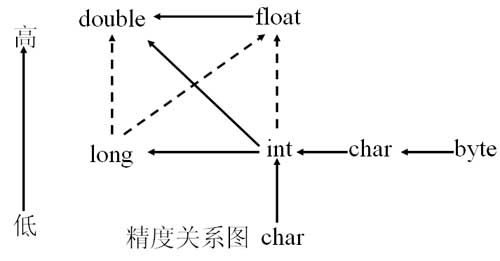

#### 与（&）、非（~）、或（|）、异或（^）

```java
int a=129;
int b=128;

// 与 &
// a&b = 128
// “a”的值是129，转换成二进制就是10000001，而“b”的值是128，转换成二进制就是10000000。根据与运算符的运算规律，只有两个位都是1，结果才是1，可以知道结果就是10000000，即128。

// 或 |
// a|b = 129
// a 的值是129，转换成二进制就是10000001，而b 的值是128，转换成二进制就是10000000，根据或运算符的运算规律，只有两个位有一个是1，结果才是1，可以知道结果就是10000001，即129。

// 非 ~
// ~a
// 位为0，结果是1，如果位为1，结果是0
// ~10001 = -1110
// ~128 = -130

// 异或 ^
// 两个操作数的位中，相同则结果为0，不同则结果为1。
// 11001 ^ 11111 = 11001

```

#### Java 中的运算符

Java运算符很多，下面按优先顺序列出了各种运算符。

| 优先级               | 运算符分类 | 结合顺序                                      | 运算符              |
| -------------------- | ---------- | --------------------------------------------- | ------------------- |
| 由高到低             | 分隔符     | 左结合                                        | .  []   ( )   ;   , |
| 一元运算符           | 右结合     | ! ++   --   -  ~                              |                     |
| 算术运算符移位运算符 | 左结合     | *   /   %  +   -   <<  >>  >>>                |                     |
| 关系运算符           | 左结合     | <   >   <=  >=  instanceof(Java 特有)  = = != |                     |
| 逻辑运算符           | 左结合     | ! && \|\| ~ & \| ^                            |                     |
| 三目运算符           | 右结合     | 布尔表达式?表达式1:表达式2                    |                     |
| 赋值运算符           | 右结合     | = *=   /= %=  +=  -=  <<= >>= >>>= &= *= \|=  |                     |

 

**一、一元运算符**

  因操作数是一个，故称为一元运算符。

| 运算符 | 含义                   | 例子       |
| ------ | ---------------------- | ---------- |
| -      | 改变数值的符号，取反   | -x（-1*x） |
| ~      | 逐位取反，属于位运算符 | ~x         |
| ++     | 自加1                  | x++        |
| --     | 自减1                  | x--        |

```java
++x 因为++在前，所以先加后用。
x++ 因为++在后，所以先用后加。

注意：a+ ++b和a+++b是不一样的（因为有一个空格）。

  int a=10;
  int b=10;
  int sum=a+ ++b;
  System.out.println("a="+a+",b="+b+",sum="+sum);
运行结果是： a=10,b=11,sum=21

  int a=10;
  int b=10;
  int sum=a+++b;
  System.out.println("a="+a+",b="+b+",sum="+sum);
运行结果是：a=11,b=10,sum=20

n=10;
m=~n;
变量n的二进制数形式：                 00000000 00000000 00000000 00001010
逐位取反后，等于十进制的-11： 11111111 11111111 11111111 11110101 
```

**二、算术运算符**

  所谓算术运算符，就是数学中的加、减、乘、除等运算。因算术运算符是运算两个操作符，故又称为二元运算符。

| 运算符 | 含义                 | 例子 |
| ------ | -------------------- | ---- |
| +      | 加法运算             | x+y  |
| -      | 减法运算             | x-y  |
| *      | 乘法运算             | x*y  |
| /      | 除法运算             | x/y  |
| %      | 取模运算（求余运算） | x%y  |



[^]: 1、实线箭头表示没有信息丢失的转换，也就是安全性的转换，虚线的箭头表示有精度损失的转化，也就是不安全的。
[^]:  2、当两个操作数类型不相同时，操作数在运算前会子松向上造型成相同的类型，再进行运算。

**三、移位运算符**

  移位运算符操作的对象就是二进制的位，可以单独用移位运算符来处理int型整数。

| 运算符 | 含义                                                         | 例子  |
| ------ | ------------------------------------------------------------ | ----- |
| <<     | 左移运算符，将运算符左边的对象向左移动运算符右边指定的位数（在低位补0） | x<<3  |
| >>     | "有符号"右移运算 符，将运算符左边的对象向右移动运算符右边指定的位数。使用符号扩展机制，也就是说，如果值为正，则在高位补0，如果值为负，则在高位补1. | x>>3  |
| >>>    | "无符号"右移运算 符，将运算符左边的对象向右移动运算符右边指定的位数。采用0扩展机制，也就是说，无论值的正负，都在高位补0. | x>>>3 |

```java
  System.out.println(Integer.toBinaryString(6297)); 
  System.out.println(Integer.toBinaryString(-6297)); 
  System.out.println(Integer.toBinaryString(6297>>5)); 
  System.out.println(Integer.toBinaryString(-6297>>5)); 
  System.out.println(Integer.toBinaryString(6297>>>5)); 
  System.out.println(Integer.toBinaryString(-6297>>>5)); 
  System.out.println(Integer.toBinaryString(6297<<5)); 
  System.out.println(Integer.toBinaryString(-6297<<5));
  
  1100010011001
  11111111111111111110011101100111
  11000100
  11111111111111111111111100111011
  11000100
  111111111111111111100111011
  110001001100100000
  11111111111111001110110011100000
```

​	**ps：x<<y 相当于 x*2y ；x>>y相当于x/2y，从计算速度上讲，移位运算要比算术运算快。如果x是负数，那么x>>>3没有什么算术意义，只有逻辑意义。**

**四、关系运算符**

Java具有完备的关系运算符，这些关系运算符同数学中的关系运算符是一致的。具体说明如下：

| 运算符 | 含义     | 例子 |
| ------ | -------- | ---- |
| <      | 小于     | x<y  |
| >      | 大于     | x>y  |
| <=     | 小于等于 | x<=y |
| >=     | 大于等于 | x>=y |
| ==     | 等于     | x==y |
| !=     | 不等于   | x!=y |

**五、逻辑运算符**

```java
// 位运算
~ & |
// 逻辑
! && ||
```

**六、三目运算符**

```java
condition ? a : b
```

**七、赋值运算符**

| 运算符 | 例子   | 含义    |
| ------ | ------ | ------- |
| +=     | x+=y   | x=x+y   |
| -=     | x-=y   | x=x-y   |
| *=     | x*=y   | x=x*y   |
| /=     | x/=y   | x=x/y   |
| %=     | x%=y   | x=x%y   |
| >>=    | x>>=y  | x=x>>y  |
| >>>=   | a>>>=y | x=x>>>y |
| <<=    | a<<=y  | x=x<<y  |
| &=     | x&=y   | x=x&y   |
| \|=    | x\|=y  | x=x\|y  |
| ^=     | x^=y   | x=x^y   |