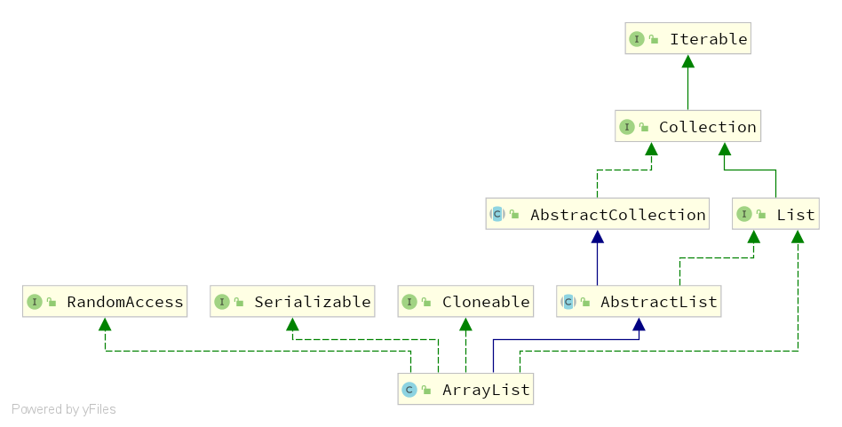
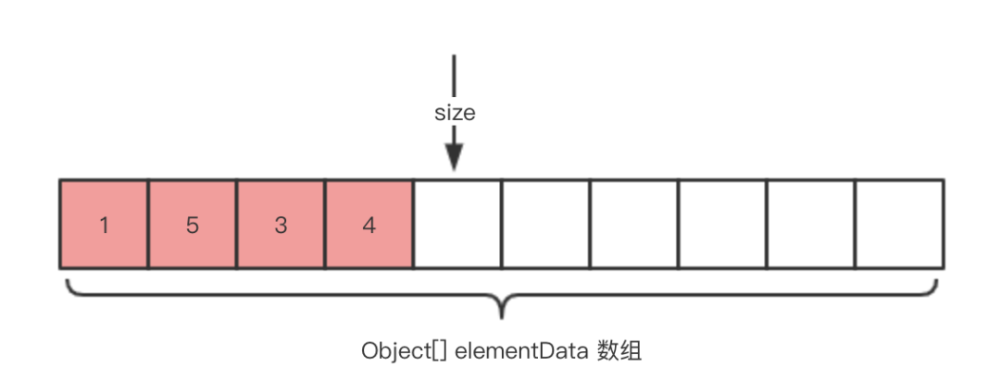

#### JDK1.8  ArrayList

##### 类图



实现了 4 个接口，分别是：

- `java.util.List` 接口，提供数组的添加、删除、修改、迭代遍历等操作。
- `java.util.RandomAccess` 接口，空接口，表示 ArrayList 支持**快速**的随机访问。
- `java.io.Serializable` 接口，表示 ArrayList 支持序列化的功能。
- `java.lang.Cloneable` 接口，表示 ArrayList 支持克隆。
  继承了 `java.util.AbstractList` 抽象类，而 AbstractList 提供了 List 接口的骨架实现，大幅度的减少了实现**迭代遍历**相关操作的代码。可能这样表述有点抽象，可以点到 `java.util.AbstractList` 抽象类中看看，例如说 `#iterator()`、`#indexOf(Object o)` 等方法。不过在下面中我们会看到，ArrayList 大量重写了 AbstractList 提供的方法实现。所以，AbstractList 对于 ArrayList 意义不大，更多的是 AbstractList 其它子类享受了这个福利

##### 属性



ArrayList 的属性很少，仅仅 **2** 个。如下图所示：

- `elementData` 属性：元素数组。其中，图中红色空格代表我们已经添加元素，白色空格代表我们并未使用。
- `size` 属性：数组大小。注意，`size` 代表的是 ArrayList 已使用 `elementData` 的元素的数量，对于开发者看到的 `#size()` 也是该大小。并且，当我们添加新的元素时，恰好其就是元素添加到 `elementData` 的位置（下标）。当然，我们知道 ArrayList **真正**的大小是 `elementData` 的大小

```java
/**
 * 关键字transient,序列化对象的时候,这个属性就不会被序列化。
 */
transient Object[] elementData; // non-private to simplify nested class access

/**
 * The size of the ArrayList (the number of elements it contains).
 *
 * @serial
 */
private int size;
```

##### 构造方法

1. **ArrayList(int initialCapacity) **附上初始化容量
2. **ArrayList(Collection<? extends E> c)** 使用传入的 `c` 集合，作为 ArrayList 的 `elementData` 。
3. **ArrayList()**

​    学习 ArrayList 的时候，一直被灌输了一个概念，在未设置初始化容量时，ArrayList 默认大小为 10 。但是此处，我们可以看到初始化为 `DEFAULTCAPACITY_EMPTY_ELEMENTDATA` 这个空数组。这是为什么呢？ArrayList 考虑到节省内存，一些使用场景下仅仅是创建了 ArrayList 对象，实际并未使用。所以，ArrayList 优化成初始化是个空数组，在首次添加元素时，才真正初始化为容量为 10 的数组。

##### 一些方法

| 方法                                                         | 描述                                          |
| :----------------------------------------------------------- | :-------------------------------------------- |
| [add()](https://www.runoob.com/java/java-arraylist-add.html) | 将元素插入到指定位置的 arraylist 中           |
| [addAll()](https://www.runoob.com/java/java-arraylist-addall.html) | 添加集合中的所有元素到 arraylist 中           |
| [clear()](https://www.runoob.com/java/java-arraylist-clear.html) | 删除 arraylist 中的所有元素                   |
| [clone()](https://www.runoob.com/java/java-arraylist-clone.html) | 复制一份 arraylist                            |
| [contains()](https://www.runoob.com/java/java-arraylist-contains.html) | 判断元素是否在 arraylist                      |
| [get()](https://www.runoob.com/java/java-arraylist-get.html) | 通过索引值获取 arraylist 中的元素             |
| [indexOf()](https://www.runoob.com/java/java-arraylist-indexof.html) | 返回 arraylist 中元素的索引值                 |
| [removeAll()](https://www.runoob.com/java/java-arraylist-removeall.html) | 删除存在于指定集合中的 arraylist 里的所有元素 |
| [remove()](https://www.runoob.com/java/java-arraylist-remove.html) | 删除 arraylist 里的单个元素                   |
| [size()](https://www.runoob.com/java/java-arraylist-size.html) | 返回 arraylist 里元素数量                     |
| [isEmpty()](https://www.runoob.com/java/java-arraylist-isempty.html) | 判断 arraylist 是否为空                       |
| [subList()](https://www.runoob.com/java/java-arraylist-sublist.html) | 截取部分 arraylist 的元素                     |
| [set()](https://www.runoob.com/java/java-arraylist-set.html) | 替换 arraylist 中指定索引的元素               |
| [sort()](https://www.runoob.com/java/java-arraylist-sort.html) | 对 arraylist 元素进行排序                     |
| [toArray()](https://www.runoob.com/java/java-arraylist-toarray.html) | 将 arraylist 转换为数组                       |
| [toString()](https://www.runoob.com/java/java-arraylist-tostring.html) | 将 arraylist 转换为字符串                     |
| [ensureCapacity](https://www.runoob.com/java/java-arraylist-surecapacity.html)() | 设置指定容量大小的 arraylist                  |
| [lastIndexOf()](https://www.runoob.com/java/java-arraylist-lastindexof.html) | 返回指定元素在 arraylist 中最后一次出现的位置 |
| [retainAll()](https://www.runoob.com/java/java-arraylist-retainall.html) | 保留 arraylist 中在指定集合中也存在的那些元素 |
| [containsAll()](https://www.runoob.com/java/java-arraylist-containsall.html) | 查看 arraylist 是否包含指定集合中的所有元素   |
| [trimToSize()](https://www.runoob.com/java/java-arraylist-trimtosize.html) | 将 arraylist 中的容量调整为数组中的元素个数   |
| [removeRange()](https://www.runoob.com/java/java-arraylist-removerange.html) | 删除 arraylist 中指定索引之间存在的元素       |
| [replaceAll()](https://www.runoob.com/java/java-arraylist-replaceall.html) | 将给定的操作内容替换掉数组中每一个元素        |
| [removeIf()](https://www.runoob.com/java/java-arraylist-removeif.html) | 删除所有满足特定条件的 arraylist 元素         |
| [forEach()](https://www.runoob.com/java/java-arraylist-foreach.html) | 遍历 arraylist 中每一个元素并执行特定操作     |

###### 数组扩容

**前置**

java中有三种移位运算符

<<    :   左移运算符，num << 1,相当于num乘以2

\>>    :   右移运算符，num >> 1,相当于num除以2

\>>>   :   无符号右移，忽略符号位，空位都以0补齐

所以下面的 oldCapacity + (oldCapacity >> 1) == 1.5*oldCapacity

```java
/**
 * Increases the capacity to ensure that it can hold at least the
 * number of elements specified by the minimum capacity argument.
 *
 * @param minCapacity the desired minimum capacity
 */
private void grow(int minCapacity) {
    // overflow-conscious code
    // 不管是手动扩容还是自动扩容 先拿到当前长度
    int oldCapacity = elementData.length;
    // 新长度等于旧长度的1.5倍 
    int newCapacity = oldCapacity + (oldCapacity >> 1);
    // 小于最小可扩容长度 就加到最小可扩容长度
    if (newCapacity - minCapacity < 0)
        newCapacity = minCapacity;
    // 大于最大扩容长度 
    if (newCapacity - MAX_ARRAY_SIZE > 0)
        newCapacity = hugeCapacity(minCapacity);
    // minCapacity is usually close to size, so this is a win:
    // 到这里已经计算出了扩容长度 执行扩容
    elementData = Arrays.copyOf(elementData, newCapacity);
}
private static int hugeCapacity(int minCapacity) {
    //最小可扩容长度小于零证明溢出
    if (minCapacity < 0) // overflow
        throw new OutOfMemoryError();
    // 最小可扩容大于最大数组长度 则让扩容长度等于最大数组长度
    return (minCapacity > MAX_ARRAY_SIZE) ?
        Integer.MAX_VALUE :
    MAX_ARRAY_SIZE;
}
```

## 总结：

ArrayList 做一个简单的小结：

- ArrayList 是基于 `[]` 数组实现的 List 实现类，支持在数组容量不够时，一般按照 **1.5** 倍**自动**扩容。同时，它支持**手动**扩容、**手动**缩容。
- ArrayList 随机访问时间复杂度是 O(1) ，查找指定元素的**平均**时间复杂度是 O(n) 。
- ArrayList 移除指定位置的元素的最好时间复杂度是 O(1) ，最坏时间复杂度是 O(n) ，平均时间复杂度是 O(n) 。最好时间复杂度发生在末尾移除的情况。
- ArrayList 移除指定元素的时间复杂度是 O(n) 因为首先需要进行查询，然后在使用移除指定位置的元素，无论怎么计算，都需要 O(n) 的时间复杂度。
- ArrayList 添加元素的最好时间复杂度是 O(1) ，最坏时间复杂度是 O(n) ，平均时间复杂度是 O(n) 。最好时间复杂度发生在末尾添加的情况