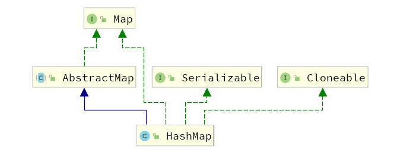
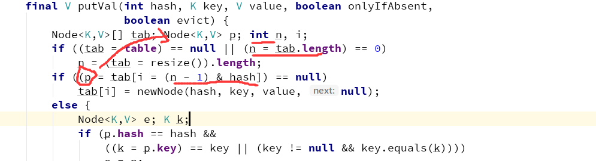
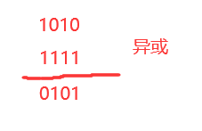
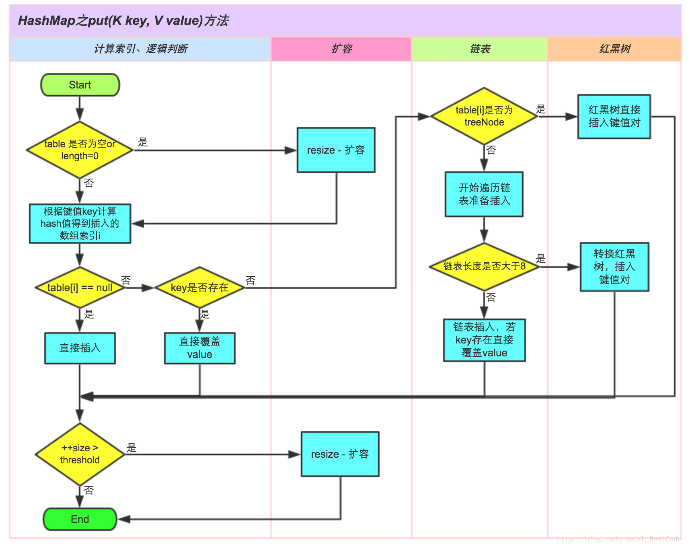

### HashMap

类图



1. #### 什么是hash？

   哈希又称散列，通过任意长度的输入，通过散列算法，变成固定长度的输出。

   哈希碰撞本身无法避免，只能通过优化算法使得其分布更加均匀。

   **优点：**插入和查找速度快，时间复杂度为O(1)

   **缺点：**

   　　1. 扩展性差，需要提前预测数据量的大小

   　　2. 不能有序遍历数据

2. ##### HashMap底层数据结构

   JDK1.7之前是数组 + 链表

   JDK1.8之后是数组 + 链表或是红黑树实现

   **为什么1.8要引入红黑树呢？**

   为了解决JDK1.7因为哈希冲突导致的链表严重链化，链表查询需要在每次向下next性能低。

3. ##### HashMap底层存储结构

   JDK1.7每个数据单元是一个Entry，JDK1.8每个数据单元是Node

   ```java
       final int hash;
       final K key;
       V value;
       Node<K,V> next;
   ```

   其中**next字段**是发生Hash冲突的时候，当前桶位中的Node与冲突Node连接成一个链表所需要的字段。

   其中hash是对key的hashCode进行的重hash。

4. ##### HashMap的长度是2的N次方，为什么这么设计呢？ （参考下10）

   ```java
   static final int hash(Object key) {
       int h;
       return (key == null) ? 0 : (h = key.hashCode()) ^ (h >>> 16);
   }
   hash & (length - 1)
   ```

   首先位运算的效率高于直接的算术运算。

   特意取2的N次方为长度，是为了 **使长度在-1后得到所有位数上的数据均为1 的二进制数**，如

   ```java
   2 ^ 1 - 1 = 1B;
   2 ^ 2 - 1 = 11B;
   2 ^ 3 - 1 = 111B;
   //... 以此类推 B表示二进制
   ```

   此时Hash对这个 2n - 1 的数进行 & 操作就能 **抹去高位** **保留同位** 这个同位几位存储的数组下标

   | tag        | &             | &           |
   | ---------- | ------------- | ----------- |
   | length - 1 | 1111          | 11111       |
   | hash       | 1000111000111 | 10101111000 |
   | 结果       | 0111          | 11000       |

   无论hash多少位，和2 ^ n - 1与操作后，只会保留尾部。

5. ##### HashMap如何保证长度为2的N次方？

   在构造方法中的tableSizeFor的作用，对传入的初始化容量大小进行格式化，保证HashMap的长度在初始化之时是2的N次方，扩容时resize也保证扩容后的长度是2的N次方。

   ```java
   /**
    * JDK1.8 tableSizeFor 
    * Returns a power of two size for the given target capacity.
    * 返回大于输入参数且最近的2的整数次幂的数。比如10，则返回16。
    */
   static final int tableSizeFor(int cap) {
       int n = cap - 1;
       n |= n >>> 1;
       n |= n >>> 2;
       n |= n >>> 4;
       n |= n >>> 8;
       n |= n >>> 16;
       return (n < 0) ? 1 : (n >= MAXIMUM_CAPACITY) ? MAXIMUM_CAPACITY : n + 1;
   }
   ```

6. ##### HashMap扩容条件

   当哈希表中的条目数超出了加载因子(LoadFactory)与当前容量(capacity)的乘积时，并且要存放的位置已经有元素了（hash碰撞）。

7. ##### 链表转红黑树的条件

   （1）链表长度达到8
   （2）当前散列表长度达到64
   以上两个条件同时满足链表才会转化为红黑树，如果仅仅链表长度达到8，它不会发生链表转红黑树，只会发生一次散列表扩容(resize)

8. ##### HashMap典型属性

   ```java
   // 默认初始化容量 16
   static final int DEFAULT_INITIAL_CAPACITY = 1 << 4; // aka 16
   // 最大容量 2^30
   static final int MAXIMUM_CAPACITY = 1 << 30;
   // 默认加载因子0.75
   static final float DEFAULT_LOAD_FACTOR = 0.75f;
   // Bucket中链表长度大于该默认值，转化为红黑树 8
   static final int TREEIFY_THRESHOLD = 8;
   // 桶中的Node被树化时最小的hash表容量 64
   static final int MIN_TREEIFY_CAPACITY = 64;
   // 扩容阈值，当 HashMap 的个数达到该值，触发扩容。
   int threshold;
   ```

9. ##### JDK1.7 与 1.8相较

   - new HashMap(); 1.7会直接创建一个长度16的数组，1.8是初始化懒加载，直到put第一个元素才会初始化数组。

   - JDK1.7 底层单元节点是Entry,JDK1.8是Node。

   - JDK1.7之前是数组 + 链表

     JDK1.8之后是数组 +链表或是红黑树实现
     
   - JDK1.7为头插法，JDK1.8为尾插法，HashMap非线程安全，在多线程情况下会有各种各样的问题，其中1.7头插法问题较为严重，会造成循环链表的情况导致死循环，因此1.8中HashMap做了较大改变，HashMap始终是非线程安全的。

     ps：HashMap的不安全体现在

     （1）在jdk1.7中，PUT会造成**数据覆盖**，扩容时会造成环**形链或数据丢失**。

     （2）在jdk1.8中，PUT会发生**数据覆盖**的情况。

10. ##### HashMap如何寻址？为什么要用位运算？为什么高十六位异或低十六位？为什么要与 length-1？

   ```java
   static final int hash(Object key) {
       int h;
       return (key == null) ? 0 : (h = key.hashCode()) ^ (h >>> 16);
   }
   ```



- 第一步 h = key.hashCode()

  `h = key.hashCode()` 表示 h 是 key 对象的 hashCode 返回值；

- 第二步 h ^ (h >>> 16)   **使得Hash打点均匀**

  `h >>> 16` 是 h 右移 16 位，因为 int 是 4 字节，32 位，所以右移 16 位后变成左边 16 个 0 + 右边原 h 的高 16 位0。**通过key的hashcode的高16位异或低16位得到的新值，异或本身是不进位的相加**

  

  **这样即使数组table的length比较小的时候，也能保证高低bit都参与到Hash的计算中，避免高16位浪费没起到作用，尽可能的得到一个均匀分布的hash**。

- 第三步 (length - 1) & hash   **得到真正的桶位索引**

  与长度-1进行异或，**抹去高位，相当于算术取模，得到与长度同位的数(即0 ~ length - 1之间)**，这也是length为什么要取2的n次方的原因了，如果不取2的n方-1那么对应的二进制有些位数会存在0，一旦出现0那么0与0或与1都是0，有些桶将永远空着导致hash不均匀。

   

   **为什么不直接用 hashCode() % length ？**

   看完源码会有疑问，为什么不直接用 key 对象的 hashCode 对哈希表长度取模？

   **寻址为什么不用取模？**

   对于上面寻址算法，由于计算机对比取模，与运算会更快。所以为了效率，HashMap 中规定了哈希表长度为 2 的 k 次方，而 2^k-1 转为二进制就是 k 个连续的 1，那么 `hash & (k 个连续的 1)` 返回的就是 hash 的低 k 个位，该计算结果范围刚好就是 0 到 2^k-1，即 0 到 length - 1，跟取模结果一样。

   也就是说，哈希表长度 length 为 2 的整次幂时， `hash & (length - 1)` 的计算结果跟 `hash % length` 一样，而且效率还更好。

   **为什么不直接用 hashCode() 而是用它的高 16 位进行异或计算新 hash 值？**

   int 类型占 32 位，可以表示 2^32 种数（范围：-2^31 到 2^31-1），而哈希表长度一般不大，在 HashMap 中哈希表的初始化长度是 16（HashMap 中的 DEFAULT_INITIAL_CAPACITY），如果直接用 hashCode 来寻址，那么相当于只有低 4 位有效，其他高位不会有影响。这样假如几个 hashCode 分别是 210、220、2^30，那么寻址结果 index 就会一样而发生冲突，所以哈希表就不均匀分布了。

   为了减少这种冲突，HashMap 中让 hashCode 的高位也参与了寻址计算（进行扰动），即把 hashCode 高 16 位与 hashCode 进行异或算出 hash，然后根据 hash 来做寻址。

11. ##### put过程

    

    1. 未初始化则resize先初始化
    2. Hash 寻slot
    3. 根据情况插入
       1. slot为null,没有hash冲突，直接插入
       2. slot为单节点，hash冲突，Node中key相同的情况下进行替换slot的Node操作，否则转换为链表
       3. slot为链表，Hash冲突，在链表尾部增加节点，长度不足则转换为红黑树
       4. slot为红黑树，将节点插入红黑树（涉及到红黑树的概念、原则、重新构建，左旋右旋等过程....）
    4. hashmap容量不够，resize扩容

    ```java
    /**
     * Implements Map.put and related methods.
     *
     * @param hash hash for key
     * @param key the key
     * @param value the value to put
     * @param onlyIfAbsent if true, don't change existing value
     * @param evict if false, the table is in creation mode.
     * @return previous value, or null if none
     */
    final V putVal(int hash, K key, V value, boolean onlyIfAbsent,
                   boolean evict) {
        Node<K,V>[] tab; Node<K,V> p; int n, i;
        // 未初始化时初始化
        if ((tab = table) == null || (n = tab.length) == 0)
            n = (tab = resize()).length;
        // 第一种情况 没有hash寻址后对应索引位位null 直接插入
        if ((p = tab[i = (n - 1) & hash]) == null)
            tab[i] = newNode(hash, key, value, null);
        // 不为null
        else {
            // 这个e要在下面寻找地址相同 key也相同的Node
            Node<K,V> e; K k;
    		// 索引位相同 key相同 直接替换
            if (p.hash == hash &&
                ((k = p.key) == key || (key != null && key.equals(k))))
                e = p;
            // 已树化 执行红黑树的添加过程
            else if (p instanceof TreeNode)
                e = ((TreeNode<K,V>)p).putTreeVal(this, tab, hash, key, value);
            // 不为空 key不相同 也不是红黑树 只能是链表了
            else {
                // for 找到链上最后一个节点
                for (int binCount = 0; ; ++binCount) {
                    if ((e = p.next) == null) {
                        // 追加
                        p.next = newNode(hash, key, value, null);
                        // TREEIFY_THRESHOLD 树化阈值 8 本次添加达到后执行
                        if (binCount >= TREEIFY_THRESHOLD - 1) // -1 for 1st
                            treeifyBin(tab, hash);
                        break;
                    }
                    // hash相同 key也相同 替换
                    if (e.hash == hash &&
                        ((k = e.key) == key || (key != null && key.equals(k))))
                        break;
                    p = e;
                }
            }
            // 如果e找到那么替换
            if (e != null) { // existing mapping for key
                V oldValue = e.value;
                if (!onlyIfAbsent || oldValue == null)
                    e.value = value;
                afterNodeAccess(e);
                return oldValue;
            }
        }
        ++modCount;
        // 检查扩容
        if (++size > threshold)
            resize();
        afterNodeInsertion(evict);
        return null;
    }
    ```

12. ##### resize扩容过程

    1. **扩容**

       

    2. **ReHash 迁移**

13. ##### 关于键值 是否允许 null

    - HashMap在put的时候会调用hash()方法来计算key的hashcode值，可以从hash算法中看出当key==null时返回的值为0。因此key为null时，hash算法返回值为0，不会调用key的hashcode方法。
    - 当HashTable存入的value为null时，抛出NullPointerException异常。如果value不为null，而key为空，在执行到int hash = key.hashCode()时同样会抛出NullPointerException异常。
    - ConcurrentHashmap和Hashtable都是支持并发的，这样会有一个问题，当你通过get(k)获取对应的value时，如果获取到的是null时，你无法判断，它是put（k,v）的时候value为null，还是这个key从来没有做过映射。HashMap是非并发的，可以通过contains(key)来做这个判断。而支持并发的Map在调用m.contains（key）和m.get(key),m可能已经不同了。

# 