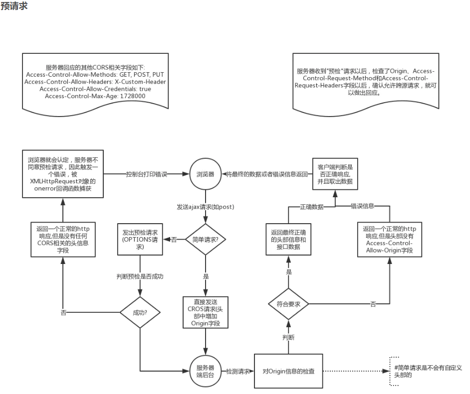

**一、负载均衡**

1.1**配置**

```nginx
http{
    #负载均衡服务器列表(tomcat)，自定义名称
    upstream myserver{
        ip_hash;
               server   115.28.52.63:8081 weight=1;  #weight代表权重，默认为1，越高被分配的客户端数量越多
        server 115.28.52.63:8081 weight=1;
    }
    server {
        listen 80;
        server_name 192.168.17.129;
        localtion / {
            proxy_pass http://myserver;
            proxy_connect_timeout 10;
        }
    }
}
```

1.2**策略**（配置在upstream内部）

1.2.1默认轮询（时间顺序逐一分配）

1.2.2当配置weight时，会指定轮询机率，主要用于处理不同服务器性能问题，weight大小与服务器性能成正比。

1.2.3.hash方式，可以解决session共享问题

```nginx
upstream myserver{
    ip_hash;
    server   115.28.52.63:8081 weight=1;  #weight代表权重，默认为1，越高被分配的客户端数量越多
    server 115.28.52.63:8081 weight=1;
}
```

1.2.4.fair（第三方）：根据后端服务器响应时间分配

```nginx
upstream myserver{
    fair;
    server   115.28.52.63:8081 weight=1;  #weight代表权重，默认为1，越高被分配的客户端数量越多
    server 115.28.52.63:8081 weight=1;
}
```

**二、nginx动静分离**

2.1**实现方式**

①静态资源单独部署，动态资源也单独部署，然后使用nginx进行域名转发（推荐）

②静态和动态资源混合在一起发布，通过nginx来实现分开，主要通过访问后缀名的方式实现分离，可设置expires来指定浏览器缓存过期时间。

**三、root和alias的区别**

root的处理结果是：root路径 ＋ location路径

alias的处理结果是：使用alias路径替换location路径

alias是一个目录别名的定义，root则是最上层目录的定义。

还有一个重要的区别是alias后面必须要用“/”结束，否则会找不到文件的，而root则可有可无。

**四、nginx高可用集群**

向外提供一个虚拟ip，该虚拟ip负责转发主从nginx服务器，使用keepalived脚本工具检测nginx是否宕机

**五、跨域问题**

5.1 预请求过程

