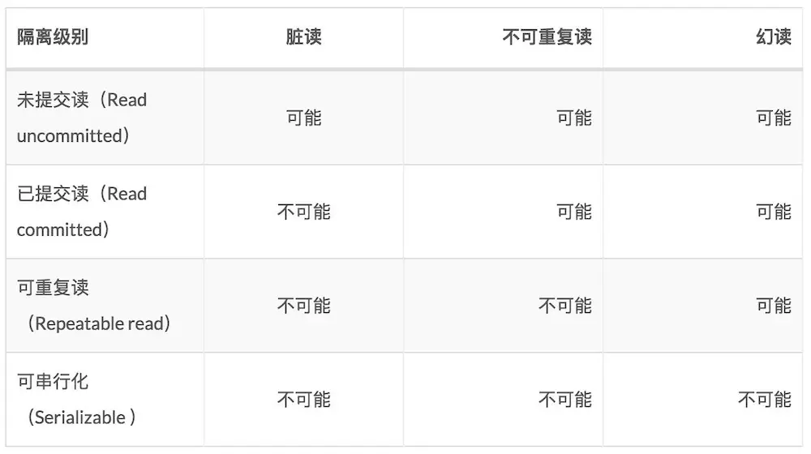

#### spring事务

1. 前置知识

   - spring的事务是建立在数据库的事务支持上的，如果你选择的数据库引擎不支持事务，如mysql的MyISAM引擎不支持事务，那么spring的事务也不会生效。
- spring事务的两种方式：编程式事务(try块手动回滚)、声明式事务(注解、xml)。
   
**声明式事务** 声明式事务可以基于注解(下用)和xml的方式进行配置。
   
```java
   // 声明式事务
@Transactional
   
   @Target({ElementType.METHOD, ElementType.TYPE})
   @Retention(RetentionPolicy.RUNTIME)
   @Inherited
   @Documented
   public @interface Transactional {
       @AliasFor("transactionManager")
       String value() default "";
   
       @AliasFor("value")
       String transactionManager() default "";
   	// 事务传播行为(意思是多事务直接调用，这个过程中事务是如何进行管理的)
       Propagation propagation() default Propagation.REQUIRED;
   	// 事务隔离级别
       Isolation isolation() default Isolation.DEFAULT;
   	// 事务超时时间
       int timeout() default -1;
   	// 是否只读
       boolean readOnly() default false;
   	// 异常回滚
       Class<? extends Throwable>[] rollbackFor() default {};
   
       String[] rollbackForClassName() default {};
   	// 不回滚
       Class<? extends Throwable>[] noRollbackFor() default {};
   
       String[] noRollbackForClassName() default {};
   }
   ```
   
2. 事务传播行为

   PROPAGATION(蔓延、传播、传输)

   | 事务传播行为类型 | 说明                                                         |
   | ---------------- | ------------------------------------------------------------ |
   | REQUIRED         | 如果当前没有事务，就新建一个事务，如果已经存在一个事务中，加入到这个事务中。这是默认的事务传播行为 |
   | REQUIRES_NEW     | 新建事务，如果当前存在事务，把当前事务挂起。（一个新的事务将启动，而且如果有一个现有的事务在运行的话，则这个方法将在运行期被挂起，直到新的事务提交或者回滚才恢复执行。） |
   | SUPPORTS         | 支持当前事务，如果当前没有事务，就以非事务方式执行。         |
   | MANDATORY        | 使用当前的事务，如果当前没有事务，就抛出异常。               |
   | NOT_SUPPORTED    | 以非事务方式执行操作，如果当前存在事务，就把当前事务挂起。   |
   | NEVER            | 以非事务方式执行，如果当前存在事务，则抛出异常。             |
   | NESTED           | 如果当前存在事务，则在嵌套事务内执行。如果当前没有事务，则执行与PROPAGATION_REQUIRED类似的操作。（外层事务抛出异常回滚，那么内层事务必须回滚，反之内层事务并不影响外层事务） |

    

3. 事务隔离级别

   隔离性指多事务操作之间不会产生影响。

   不考虑隔离性会产生**脏读、不可重复读、虚读(幻读)** 问题。

   **1) Dirty Reads 脏读** 
   一个事务正在对数据进行更新操作，但是更新还未提交，另一个事务这时也来操作这组数据，并且读取了前一个事务还未提交的数据，而前一个事务如果操作失败进行了回滚，后一个事务读取的就是错误数据，这样就造成了脏读。
   **2) Non-Repeatable Reads 不可重复读** 
   一个事务多次读取同一数据，在该事务还未结束时，另一个事务也对该数据进行了操作，而且在第一个事务两次次读取之间，第二个事务对数据进行了更新，那么第一个事务前后两次读取到的数据是不同的，这样就造成了不可重复读。

   **3) Phantom Reads 幻像读** 虚读幻读
   第一个数据正在查询符合某一条件的数据，这时，另一个事务又插入了一条符合条件的数据，第一个事务在第二次查询符合同一条件的数据时，发现多了一条前一次查询时没有的数据，仿佛幻觉一样，这就是幻像读。

   **2.隔离级别：**

   **1) DEFAULT （默认）** 
   这是一个PlatfromTransactionManager默认的隔离级别，使用数据库默认的事务隔离级别。另外四个与JDBC的隔离级别相对应。

   **2) READ_UNCOMMITTED （读未提交）** 
   这是事务最低的隔离级别，它允许另外一个事务可以看到这个事务未提交的数据。这种隔离级别会产生脏读，不可重复读和幻像读。 

   **3) READ_COMMITTED （读已提交）** 
   保证一个事务修改的数据提交后才能被另外一个事务读取，另外一个事务不能读取该事务未提交的数据。这种事务隔离级别可以避免脏读出现，但是可能会出现不可重复读和幻像读。 

   **4) REPEATABLE_READ （可重复读）** 
   这种事务隔离级别可以防止脏读、不可重复读，但是可能出现幻像读。它除了保证一个事务不能读取另一个事务未提交的数据外，还保证了不可重复读。

   **5) SERIALIZABLE（串行化）** 
   这是花费最高代价但是最可靠的事务隔离级别，事务被处理为顺序执行。除了防止脏读、不可重复读外，还避免了幻像读。 

   **设置隔离级别解决事务并行引起的问题：**

   
