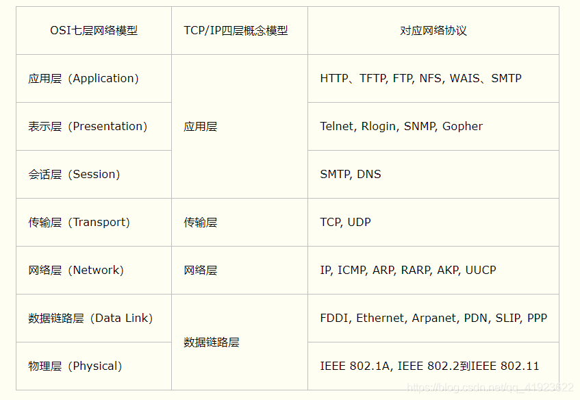
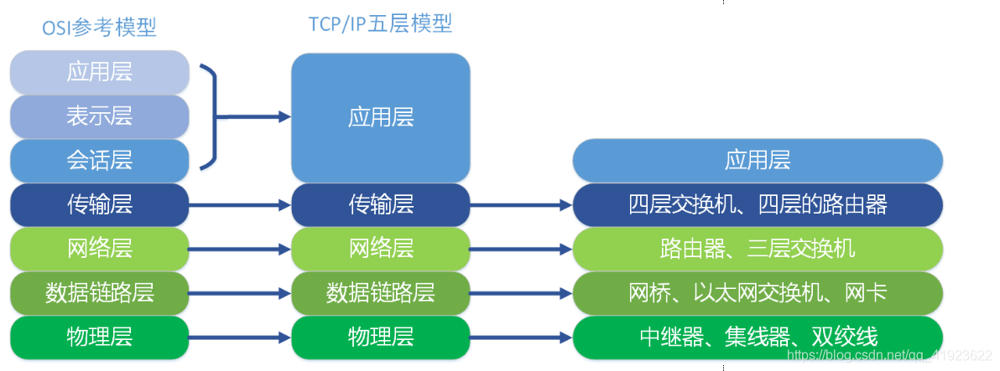
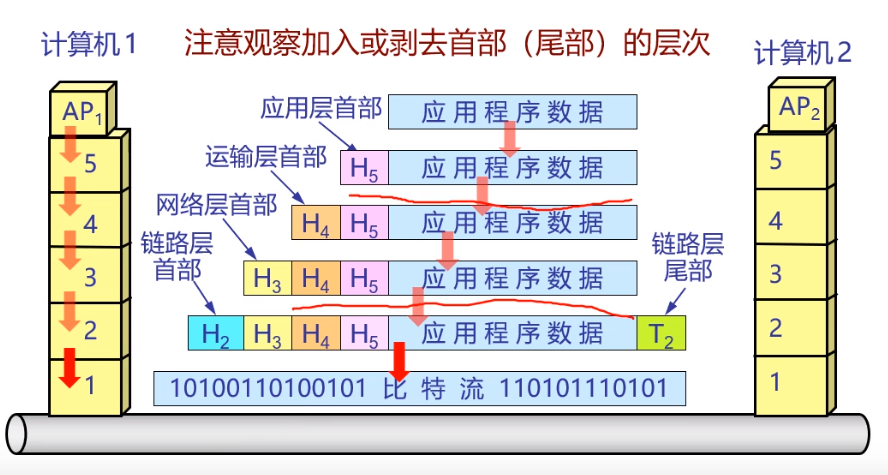
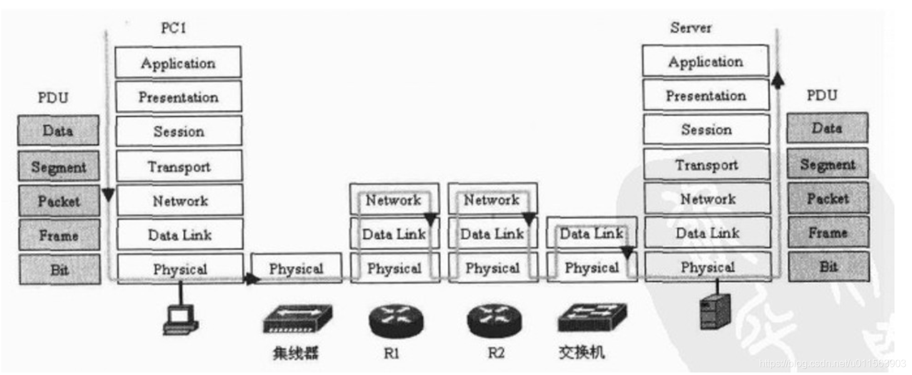

#### 小家庭网络如何组网？为什么能够访问互联网？

1. 通过小路由器实现家庭组网，路由的每个出口(接线端口或无线信号)会赋予内网Ip。

   注：不经过路由器也可以直连，路由器能更方便的管理和拓展网络。

2. 向运营商开通宽带服务，运营商负责分配外网Ip和接入验证完成个人到运营商的接入。

   注：国内知名网络运营商，中国电信、中国网通、中国移动、中国联通。

3. 运营商通过“国家级互联网骨干直联点”接入的国内互联网络（主干网通信），完成个人到互联网的接入。

   注：*国家级互联网骨干直联点*，作为国家重要通信枢纽，主要用于汇聚和疏通区域乃至全国网间通信流量，是我国互联网网间互联架构的顶层关键环节。

#### 为什么要分层？

1. 统一标准，形成统一的规范，网络接入方必须使用符合网络各层协议的分层才能接入网络互相通信。
2. 独立功能，各层次发生变化，只要接口不变，不会影响其他层。
3. 高低分层，将更贴切于用户的层次(如应用层)置于上层，而将复杂的底层的置于下层。
4. 大事化小，将一个大问题分解成若干小问题。

#### OSI七层模型和TCP/IP四层模型

#### 数据如何传输？

1. **封装报文是从上层到下层**(应用层 --> 传输层 --> 网络层 – > 数据链路层 --> 物理层)，**解封装报文是从下层到上层**。
2. 分组交换

